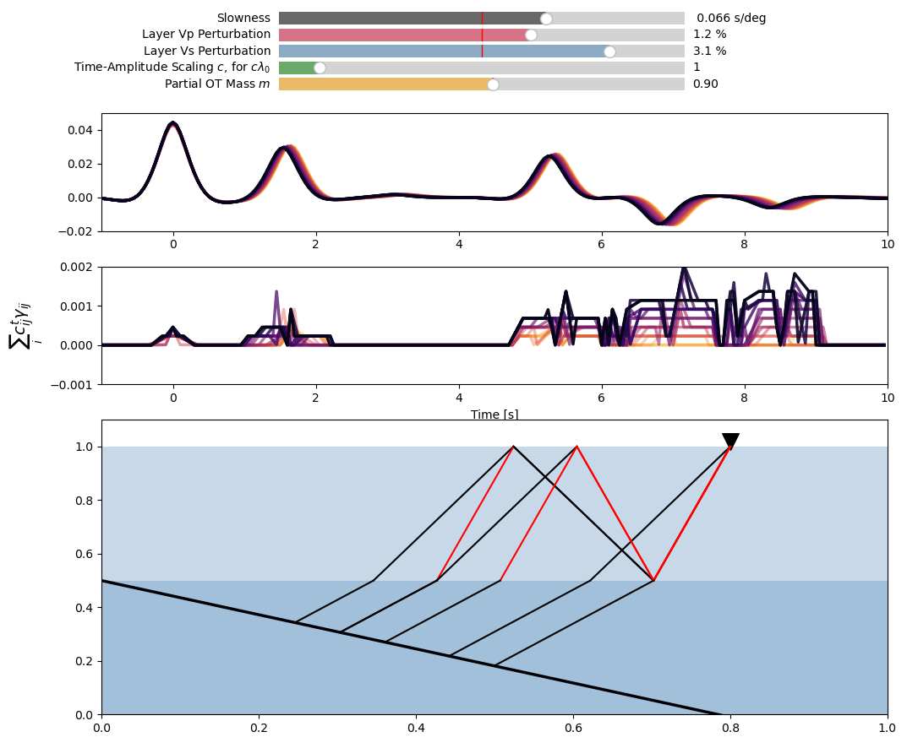

## Receiver function monitoring with optimal transport
The codes in this repository demonstrate the method and reproduce the figures from Bryan et al. (2023). An interactive demonstration of the method is included, which can be run by `python interactive_RF_OT_dist.py`, provided you have installed [Telewavesim](https://github.com/paudetseis/Telewavesim) and [POT](https://github.com/PythonOT/POT).

#### References
- Bryan, J., Frank, W.B., Audet, P. (2023). Capturing seismic velocity changes in receiver functions with optimal transport, Geophysical Journal International, 234(2), 1282–1306, https://doi.org/10.1093/gji/ggad130
- Audet, P., Thomson, C.J., Bostock, M.G., and Eulenfeld, T. (2019). Telewavesim: Python software for teleseismic body wave modeling. Journal of Open Source Software, 4(44), 1818, https://doi.org/10.21105/joss.01818
- Flamary, R., Courty, N., Gramfort, A., Alaya, M. Z., Boisbunon, A., Chambon, S., Chapel, L., Corenflos, A., Fatras, K., Fournier, N., Gautheron, L., Gayraud, N. T. H., Janati, H., Rakotomamonjy, A., Redko, I., Rolet, A., Schutz, A., Seguy, V., Sutherland, D. J., Tavenard, R., Tong, A., and Vayer, T. (2021) POT Python Optimal Transport library, Journal of Machine Learning Research, 22(78):1−8.
